# OpenFOAM Motorbike RANS — Velocity Sweep

Steady-state RANS simulation of the OpenFOAM motorbike tutorial geometry across three freestream velocities (20, 30, 40 m/s). Uses the k-ω SST turbulence model with the SIMPLE algorithm.

## Setup

- **Solver:** `incompressibleFluid` (foamRun), steady SIMPLE
- **Turbulence:** k-ω SST (RAS)
- **Mesh:** snappyHexMesh on the motorBike STL geometry (~200k cells)
- **Decomposition:** scotch, 8 cores
- **Iterations:** 500 per velocity

### Turbulence inlet conditions

Scaled from a 20 m/s baseline (k=0.24 m²/s², ω=1.78 rad/s):

| U∞ (m/s) | k (m²/s²) | ω (rad/s) |
|----------|-----------|-----------|
| 20       | 0.24      | 1.78      |
| 30       | 0.54      | 2.67      |
| 40       | 0.96      | 3.56      |

k scales as U², ω scales linearly with U.

## Results

### Aerodynamic Coefficients

| U∞ (m/s) | Cd     | Cl     |
|----------|--------|--------|
| 20       | 0.403  | 0.073  |
| 30       | 0.400  | 0.073  |
| 40       | 0.401  | 0.072  |

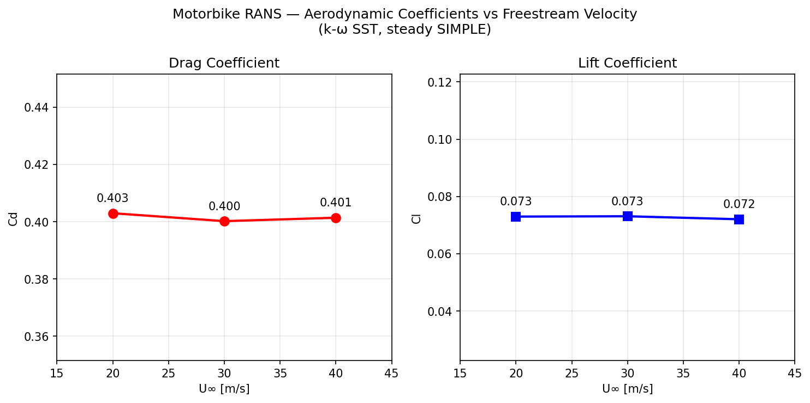

### Why Cd and Cl are constant across velocity

Cd and Cl are dimensionless force coefficients defined as:

$$C_d = \frac{F_{drag}}{\frac{1}{2} \rho U_\infty^2 A_{ref}}, \qquad C_l = \frac{F_{lift}}{\frac{1}{2} \rho U_\infty^2 A_{ref}}$$

The denominator is the dynamic pressure times a reference area — it represents the "available" aerodynamic force at a given speed. The numerator, the actual drag or lift force, scales in exactly the same way with velocity. Here is why.

**Incompressible Navier-Stokes equations are linear in dynamic pressure.** For a steady incompressible flow, the governing equations can be non-dimensionalised using U∞ and a reference length L. The only remaining parameter is the Reynolds number Re = U∞L/ν. Two flows at the same Re but different U∞ are mathematically identical after non-dimensionalisation — the pressure field, velocity field, and surface stress distributions are all the same in coefficient form.

**Consequence for forces.** The pressure on the surface scales as ½ρU∞², and the viscous shear stress scales the same way (since it is proportional to μ · ∂u/∂y, and the velocity gradient scales as U∞/L). Integrating either over the surface gives a force that scales exactly as ½ρU∞²A. Dividing by ½ρU∞²A therefore cancels the velocity dependence entirely, and Cd and Cl become functions of Re only.

**Reynolds number effect.** These three runs span Re ≈ 1.9×10⁶ to 3.8×10⁶ (based on wheelbase L=1.42 m). Over this range, the turbulent boundary layer is already fully attached and the k-ω SST model produces a separation pattern that is essentially Re-insensitive at this geometry. The <1% variation seen in the results is solver noise, not a physical trend.

**What does change with velocity.** The dimensional drag force F = Cd · ½ρU∞²A scales as U∞², so doubling the speed quadruples the drag force and the power required to overcome it (P = F·U ∝ U³). The coefficient plot shows the collapse to a single value; a plot of raw force versus velocity would show a clean U² curve.

**Contrast with compressible flow.** At higher Mach numbers (Ma > ~0.3) compressibility introduces an additional non-dimensional parameter (Ma) that breaks this similarity. Shock waves, wave drag, and density variations cause Cd to rise sharply with velocity even in coefficient form — the famous drag-divergence phenomenon. At 20–40 m/s (Ma ≈ 0.06–0.12) we are well within the incompressible regime and none of that applies.

### Force Coefficient Convergence

| 20 m/s | 30 m/s | 40 m/s |
|--------|--------|--------|
| 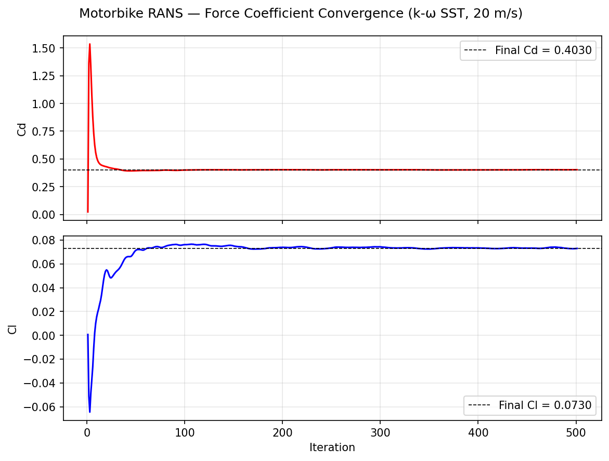 | 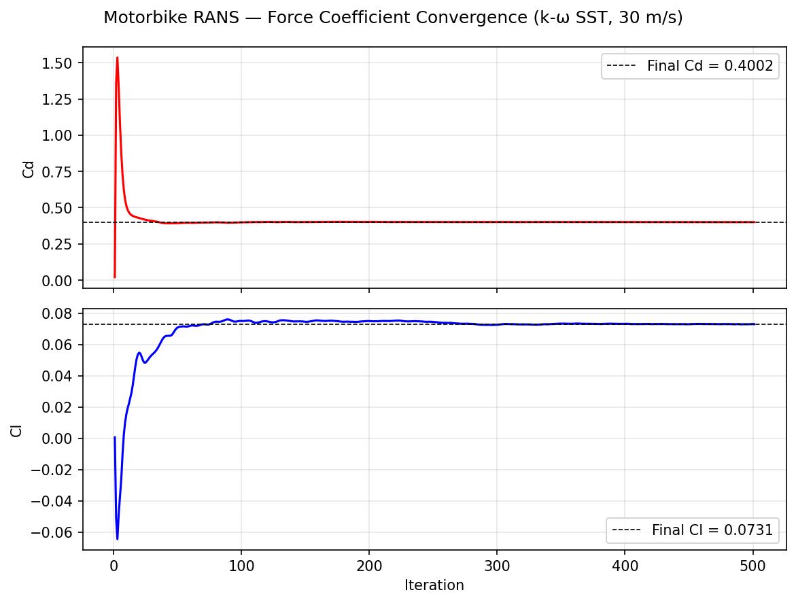 | 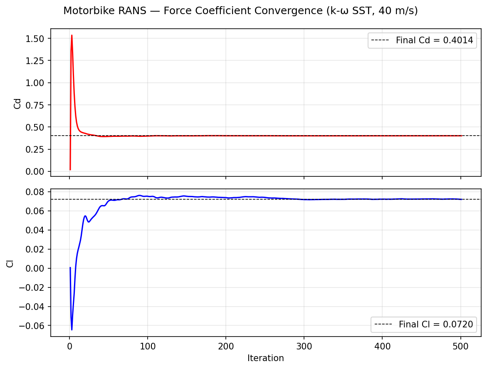 |

### Surface Pressure (Cp = p / ½ρU²)

The Cp distributions are also velocity-independent for the same reason — surface pressure normalised by dynamic pressure collapses to the same field at all three speeds.

#### 20 m/s
| Side | Front | Rear | Iso |
|------|-------|------|-----|
| 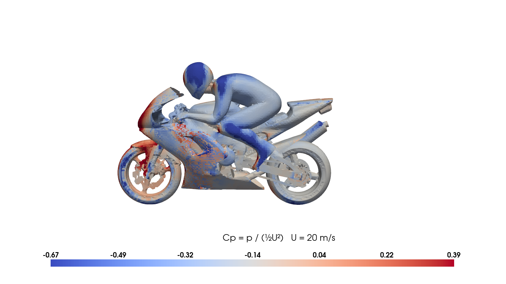 | 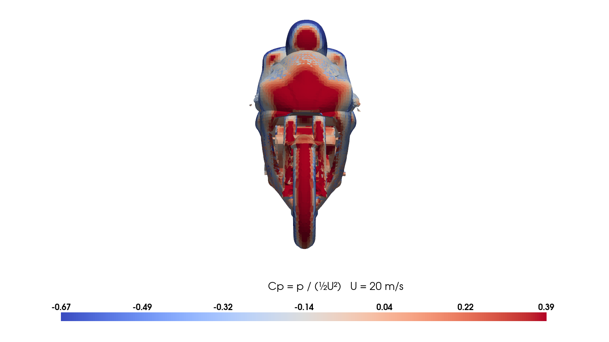 |  | 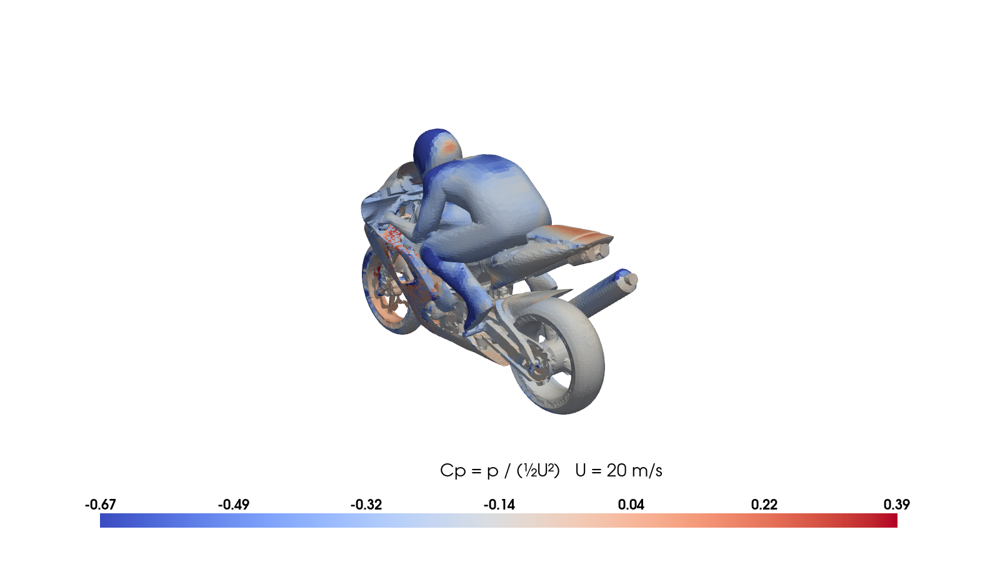 |

#### 30 m/s
| Side | Front | Rear | Iso |
|------|-------|------|-----|
| 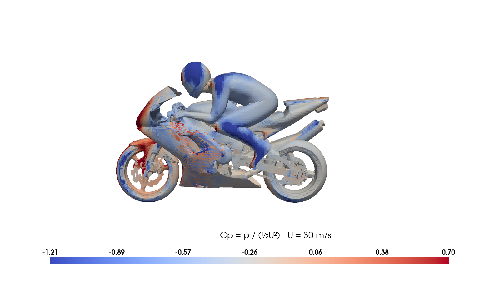 | 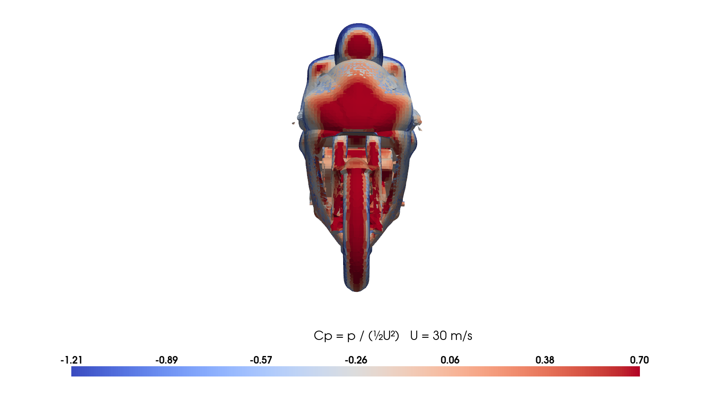 | 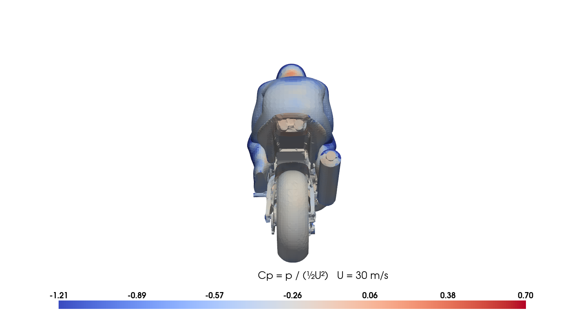 |  |

#### 40 m/s
| Side | Front | Rear | Iso |
|------|-------|------|-----|
|  | 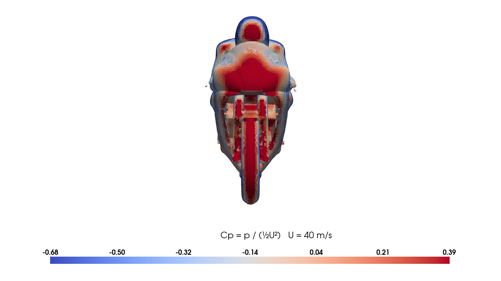 |  | 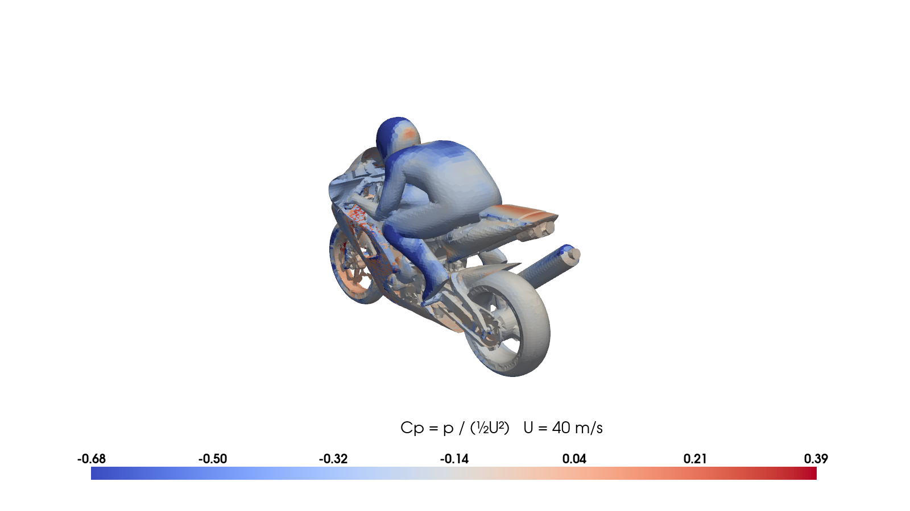 |

## Running

### Full mesh + first solve (20 m/s)

```bash
source /opt/openfoam13/etc/bashrc
./Allrun
```

### Additional velocity runs (reuses mesh)

```bash
bash run_velocity.sh 30
bash run_velocity.sh 40
```

`run_velocity.sh` resets the boundary conditions and the `forceCoeffs` reference velocity, then re-runs potentialFoam and foamRun on the existing mesh.

### Post-processing

```bash
# Single velocity (force convergence + surface Cp renders)
python3 postprocess.py 20
python3 postprocess.py 30
python3 postprocess.py 40

# Combined Cd/Cl vs velocity plot
python3 postprocess.py combined
```

All outputs are written to `results/` with velocity suffix (e.g. `pressure_side_30ms.png`).

## Software

- OpenFOAM 13
- Python 3.10 (matplotlib, numpy, pyvista)
